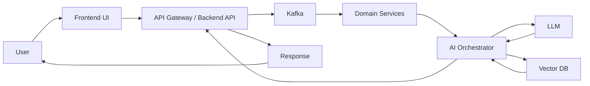

# Architecture Diagram

The intended end-to-end flow is:

`User -> API -> Kafka -> Services -> LLM -> Vector DB -> Response`

## Component notes

- `User`: Claims adjuster, operations analyst, or claimant using the dashboard.
- `API`: Entry point for intake, claim retrieval, scoring, and AI requests.
- `Kafka`: Event backbone for claim-submitted, documents-uploaded, enrichment-requested, and decision-updated events.
- `Services`: Business services for claim validation, policy checks, fraud/risk heuristics, and orchestration.
- `LLM`: Summarization, extraction, recommendation generation, and narrative reasoning.
- `Vector DB`: Stores embeddings for claim history, documents, policy knowledge, and retrieval context.
- `Response`: Structured result returned to the UI and downstream systems.

## Suggested event flow

1. User submits or updates a claim from the frontend.
2. Backend API validates the request and emits an event to Kafka.
3. Domain services consume the event and enrich the claim with business context.
4. AI orchestration retrieves relevant context from the vector database.
5. LLM generates summaries, extracted facts, and recommended next steps.
6. Final response is returned to the API and surfaced in the frontend.
